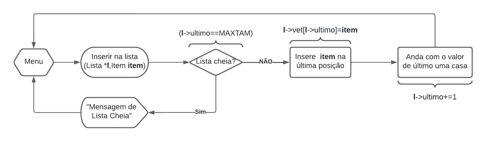
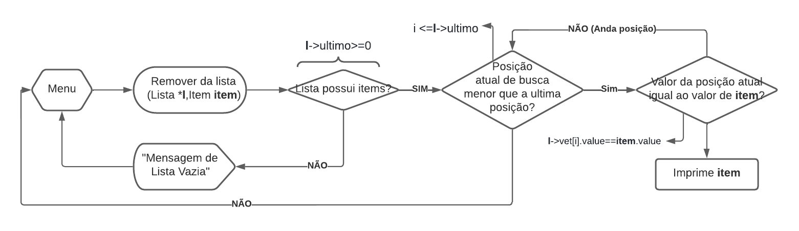
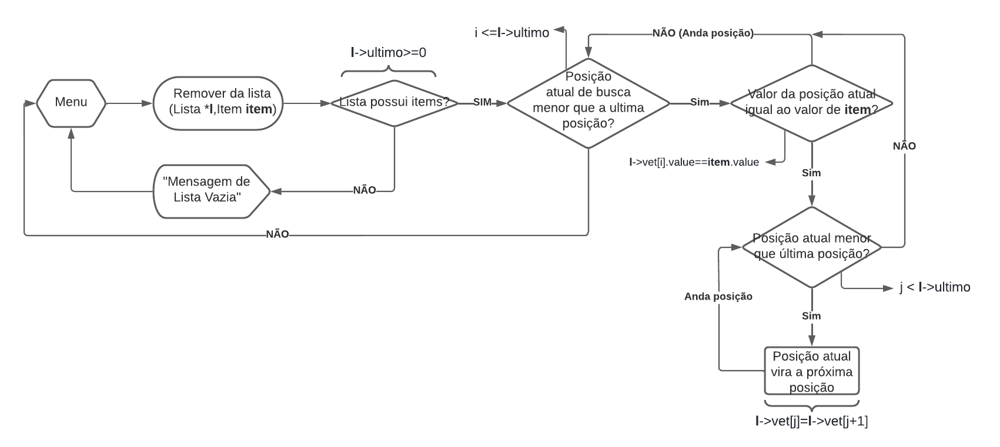

# List_Fluxogram
Faça um diagrama para representar uma inserção, remoção e pesquisa em uma
lista linear.
# Logica
Foi-se feito três fluxogramas (utilizando o software <a href="https://www.lucidchart.com/pages/" target="_blank">Lucidchart</a>) possuindo em cada um, uma das funções pedidas:    
<h2>Inserção</h2>

 

O diagrama representa um método com a função de inserir um item do tipo **Item** em uma lista tipo **Lista**, que é escolhido a partir de um menu, e segue as instruções:

1) Verifica se a lista está cheia, caso esteja volta ao menu;
2) Insere o item que foi informado no final da lista;
3) Aumenta o valor da ultima casa da lista;
<h2>Pesquisa</h2>

 

O diagrama representa um método com a função de pesquisar um item do tipo **Item** em uma lista tipo **Lista**, que é escolhido a partir de um menu, e segue as instruções:

1) Verifica se a lista possui itens, caso não possua volta ao menu;
2) Entra em um looping para procurar o item informado:
    - A cada iteração verifica se o item dessa posição é igual ao item informado, se sim, o imprime, se não vai para a próxima posição.

<h2>Remoção</h2>

 

O diagrama representa um método com a função de remover um item do tipo **Item** em uma lista tipo **Lista**, que é escolhido a partir de um menu, e segue as instruções:

1) Verifica se a lista possui itens, caso não possua volta ao menu;
2) Entra em um looping para procurar o item informado:
    - A cada iteração verifica se o item dessa posição é igual ao item informado, se sim:
        - Entra em um looping para mover a próxima posição para a posição atual (uma maneira de excluir o item da linha), até o último item.
    - Se não:
        - Anda a posição. 
